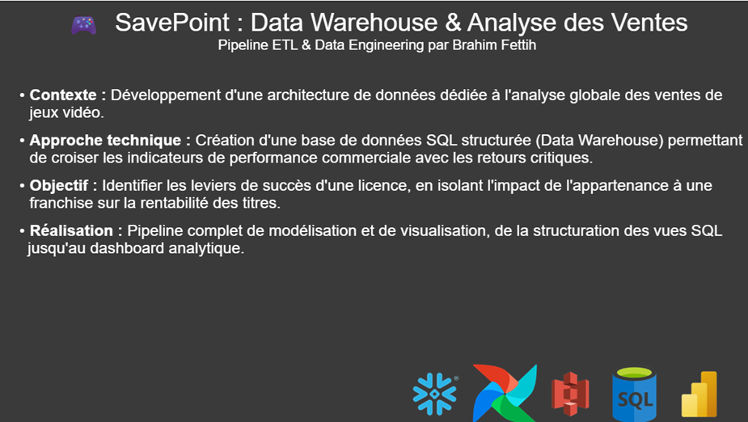
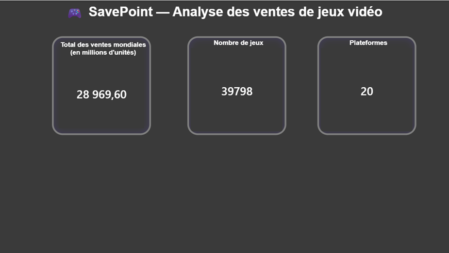
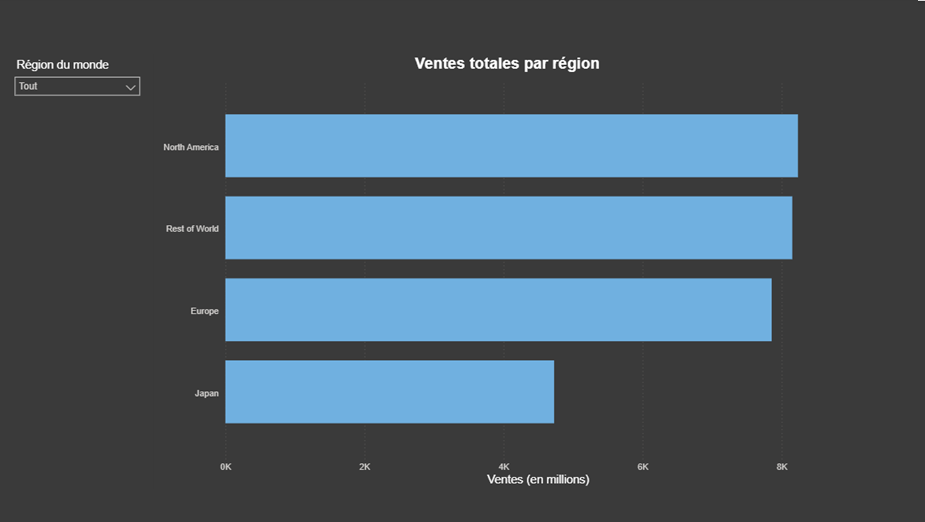
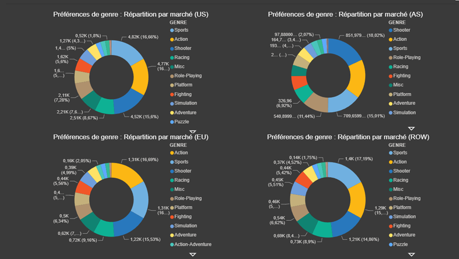
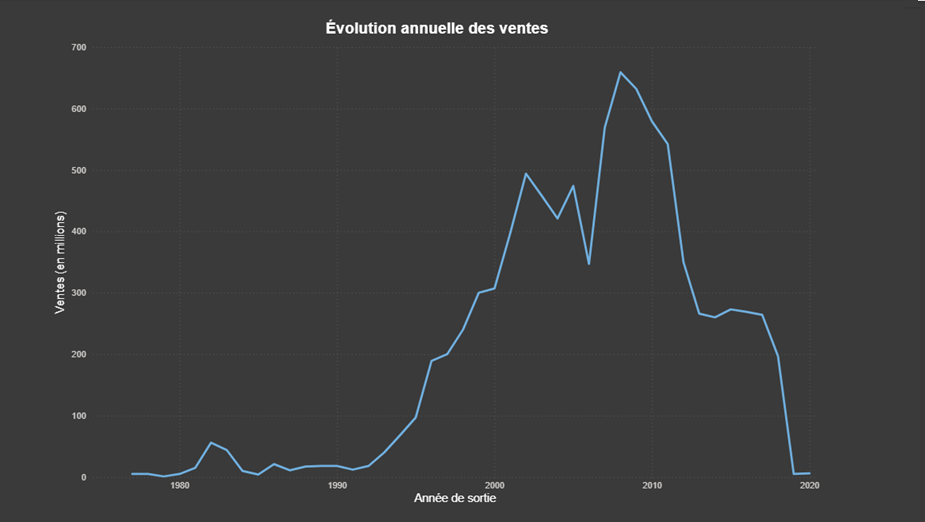
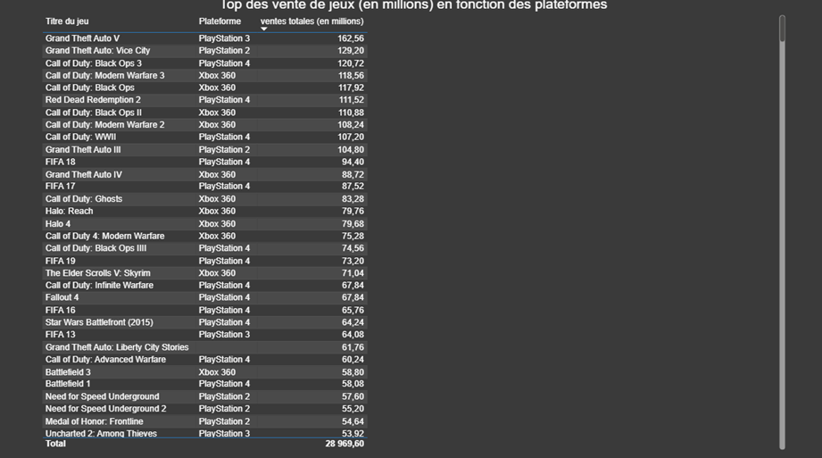
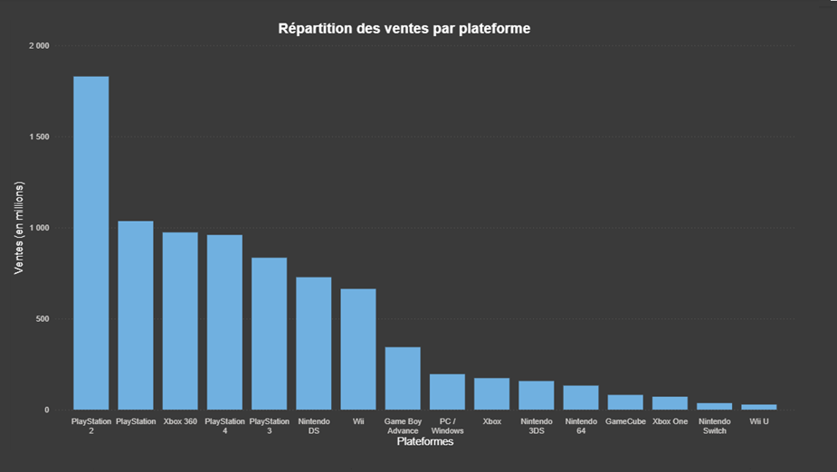
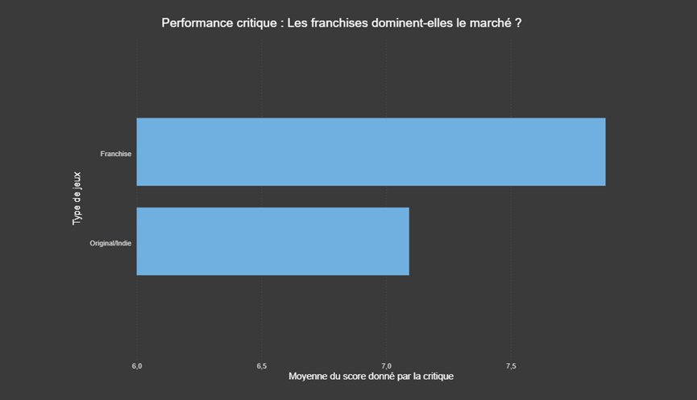
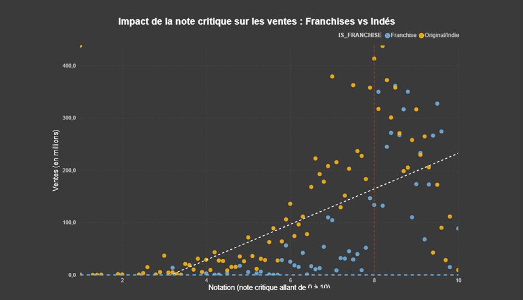

# 🎮 SavePoint — Projet Data Engineer

Pipeline complet d'analyse des ventes de jeux vidéo par plateforme, genre et région mondiale.

Pourqoui ce projet ?

Au-delà de l'exercice technique, ce projet est né d'une réflexion personnelle sur l'évolution de l'industrie du jeu vidéo. En tant qu'amateur, je voulais analyser si les données de vente corrélaient avec ce que beaucoup de joueurs perçoivent comme un 'âge d'or' de la créativité et de la prise de risque des éditeurs. Pour moi, le Data Engineering, c'est aussi cela : être capable d'interroger la donnée pour vérifier ou infirmer des intuitions métier ou personnelles.

## 🛠️ Stack technique

[](https://www.python.org/)
[](https://airflow.apache.org/)
[](https://www.docker.com/)
[](https://www.snowflake.com/)
[](https://aws.amazon.com/s3/)
[](https://www.postgresql.org/)
[](https://rawg.io/apidocs)
[](https://powerbi.microsoft.com/)
---

## 📁 Structure du projet

```
SavePoint/
├── README.md
├── requirements.txt
├── .env.example
│
├── analysis/
│   └── explore_data.py           ← EDA standalone (Match Rate RAWG, visualisations)
│
├── ingestion/
│   ├── ingestion.py              ← Pipeline standalone (CSV → Parquet)
│   ├── ingestion_snowflake.py    ← Chargement vers Snowflake
│   ├── enrichment_rawg.py        ← Enrichissement via RAWG API
│   └── upload_to_s3.py           ← Upload du Data Lake vers AWS S3
│
├── sql/
│   ├── schema.sql                ← Schéma Data Warehouse (PostgreSQL)
│   └── schema_snowflake.sql      ← Schéma Data Warehouse (Snowflake)
│
├── dags/
│   └── dag_airflow.py            ← DAG Airflow (orchestration hebdomadaire)
│
├── airflow/
│   ├── docker-compose.yaml       ← Environnement Airflow (Docker)
│   └── dags/                     ← DAGs détectés par Airflow
│
├── notebooks/
│   └── analyse_savepoint.ipynb   ← Analyse exploratoire (Jupyter)
│
├── dashboard/
│   └── SavePoint.pbix            ← Dashboard Power BI
│
├── screenshots/                  ← Captures du dashboard Power BI
│
└── data/
    ├── raw/                      ← CSV brut Kaggle (vgchartz-2024.csv)
    └── staged/                   ← Parquet nettoyé + enrichi
```

---

## 🗃️ Sources de données

| Source | URL | Contenu |
|--------|-----|---------|
| Kaggle VGSales 2024 | [asaniczka/video-game-sales-2024](https://www.kaggle.com/datasets/asaniczka/video-game-sales-2024) | 64 000 jeux, ventes NA/EU/JP/Other |
| Maven Analytics | [mavenanalytics.io](https://mavenanalytics.io/data-playground/video-game-sales) | Même dataset, sans compte Kaggle |
| RAWG API | [rawg.io/apidocs](https://rawg.io/apidocs) | Ratings, genres, ESRB, développeurs |

---

## 🏗️ Architecture

```
Kaggle CSV
    │
    ▼
ingestion.py          ← Nettoyage, normalisation, pivot régions
    │
    ▼
enrichment_rawg.py    ← Enrichissement RAWG API (critic_score, developer...)
    │
    ▼
data/staged/          ← Parquet partitionné (continent= / year=)
    │
    ├──────────────────────┐
    ▼                      ▼
upload_to_s3.py      ingestion_snowflake.py
    │                      │
    ▼                      ▼
AWS S3                Snowflake Data Warehouse (SAVEPOINT)
(Data Lake)            ┌─────────────────────────────────┐
savepoint-datalake-bf  │  DIM_GAME                       │
                        │  DIM_PLATFORM                   │
                        │  DIM_GENRE                       │
                        │  DIM_REGION                      │
                        │  FACT_SALES  ← table centrale    │
                        └─────────────────────────────────┘
                                       │
                                       ▼
                        Power BI Dashboard (5 pages)
                        ├── Vue globale
                        ├── Ventes par région
                        ├── Évolution temporelle
                        ├── Plateformes
                        └── Top jeux

Orchestration : Apache Airflow (Docker)
└── savepoint_snowflake_pipeline
    init_directories → check_files → load_dimensions → load_facts → data_quality_check
```

---

## 🗄️ Compatibilité bases de données

Ce projet a été développé en deux phases :

| Phase | Base de données | Fichier |
|-------|----------------|---------|
| Développement local | PostgreSQL | `sql/schema.sql` |
| Production cloud | Snowflake | `sql/schema_snowflake.sql` |

Le schéma en étoile est identique dans les deux cas.
La migration vers Snowflake permet une scalabilité cloud et une
intégration native avec Power BI en DirectQuery.

---

## ☁️ Data Lake AWS S3

Les fichiers Parquet du Data Lake sont sauvegardés sur AWS S3 en complément
du stockage local, pour simuler une architecture cloud réelle :

```
s3://savepoint-datalake-bf/
└── savepoint/
    └── staged/
        ├── vgsales_enriched.parquet
        └── partitioned/
            └── continent=.../year=.../data.parquet
```

Configuration requise dans `.env` :
```env
AWS_ACCESS_KEY_ID=...
AWS_SECRET_ACCESS_KEY=...
AWS_REGION=eu-west-3
S3_BUCKET_NAME=savepoint-datalake-bf
```

---

## 🚀 Démarrage rapide

### 1. Prérequis

```bash
pip install -r requirements.txt
```

### 2. Configuration

```bash
cp .env.example .env
# Remplis les variables dans .env
```

### 3. Télécharger les données

```bash
# Via Kaggle CLI
kaggle datasets download -d asaniczka/video-game-sales-2024 --unzip -p data/raw/

# Ou sans compte sur Maven Analytics :
# https://mavenanalytics.io/data-playground/video-game-sales
```

### 4. Option A — PostgreSQL (local)

```bash
# Créer le schéma
psql -U postgres -d savepoint -f sql/schema.sql

# Lancer l'ingestion
python ingestion/ingestion.py data/raw/vgchartz-2024.csv
```

### 5. Option B — Snowflake (cloud)

```bash
# 1. Exécuter sql/schema_snowflake.sql dans une Snowflake Worksheet

# 2. Enrichissement RAWG (optionnel)
python ingestion/enrichment_rawg.py

# 3. Chargement vers Snowflake
python ingestion/ingestion_snowflake.py
```

### 6. Sauvegarde sur AWS S3 (optionnel)

```bash
python ingestion/upload_to_s3.py
```

### 7. Analyse exploratoire

```bash
# Script standalone EDA
python analysis/explore_data.py

# Ou via Jupyter
jupyter notebook notebooks/analyse_savepoint.ipynb
```

### 8. Orchestration via Airflow (Docker)

```bash
cd airflow

# Initialiser Airflow
docker compose up airflow-init

# Lancer tous les services
docker compose up -d

# Interface web : http://localhost:8080 (airflow / airflow)
```

Configurer la connexion Snowflake dans **Admin → Connections** :
- Connection Id : `snowflake_savepoint`
- Connection Type : `Snowflake`
- Login : ton username Snowflake
- Password : ton mot de passe
- Schema : `PUBLIC`
- Extra : `{"account": "KFJGQMC-UL17173", "database": "SAVEPOINT", "warehouse": "COMPUTE_WH", "role": "ACCOUNTADMIN"}`

---

## 📐 Modèle de données (schéma en étoile)

```
dim_genre ────┐
              │
dim_platform ─┼──→ fact_sales ←─── dim_region
              │     (ventes)
dim_game ─────┘
```

### Colonnes clés de FACT_SALES

| Colonne | Type | Description |
|---------|------|-------------|
| GAME_ID | FK | Référence DIM_GAME |
| PLATFORM_ID | FK | Référence DIM_PLATFORM |
| GENRE_ID | FK | Référence DIM_GENRE |
| REGION_ID | FK | Référence DIM_REGION |
| RELEASE_YEAR | NUMBER | Année de sortie |
| SALES_MILLIONS | FLOAT | Ventes en millions d'unités |
| GLOBAL_SALES | FLOAT | Total mondial (dénormalisé) |

---

## 📊 Exemples de requêtes analytiques

### Top 10 jeux par ventes en Europe
```sql
SELECT dga.TITLE, dp.PLATFORM_NAME, SUM(fs.SALES_MILLIONS) AS SALES_M
FROM FACT_SALES fs
JOIN DIM_GAME     dga ON fs.GAME_ID     = dga.GAME_ID
JOIN DIM_PLATFORM dp  ON fs.PLATFORM_ID = dp.PLATFORM_ID
JOIN DIM_REGION   dr  ON fs.REGION_ID   = dr.REGION_ID
WHERE dr.REGION_CODE = 'EU'
GROUP BY dga.TITLE, dp.PLATFORM_NAME
ORDER BY SALES_M DESC
LIMIT 10;
```

### Ventes par genre et continent
```sql
SELECT * FROM VW_SALES_CONTINENT_GENRE
ORDER BY TOTAL_SALES_M DESC;
```

### Évolution annuelle du marché
```sql
SELECT * FROM VW_YEARLY_GLOBAL_SALES
WHERE RELEASE_YEAR BETWEEN 2000 AND 2024;
```

### Plateformes dominantes par région
```sql
SELECT * FROM VW_TOP_PLATFORMS_BY_REGION LIMIT 20;
```

---

## 🔄 Orchestration Airflow — Ordre des tâches

```
init_directories
      │
      ▼
check_files          ← Vérifie la présence du fichier source
      │
      ▼
load_dimensions      ← DIM_GAME, DIM_GENRE (batch insert, IDs en mémoire)
      │
      ▼
load_facts           ← FACT_SALES (pivot régions, batch de 500)
      │
      ▼
data_quality_check   ← Contrôles intégrité Snowflake
```

Le DAG s'exécute automatiquement chaque semaine (`schedule="@weekly"`)
et peut être déclenché manuellement depuis l'interface Airflow.

---

## 📸 Dashboard Power BI











---

## 🛠️ Extensions possibles

- **dbt** : transformations SQL versionnées
- **Apache Spark** : passer à PySpark pour de plus gros volumes
- **Great Expectations** : renforcer les contrôles qualité
- **API IGDB** : enrichissement complémentaire (covers, modes multijoueur)
- **AWS Lambda** : déclencher automatiquement l'ingestion à l'arrivée d'un nouveau fichier S3
